# System Performance ETL Pipeline mit PowerShell und MongoDB

## Projektbeschreibung

Dieses Projekt implementiert eine ETL-Pipeline (Extract, Transform, Load) zur automatisierten Erfassung und Analyse von System- und Prozessleistungsdaten auf einem Windows Server 2022 System.

Die Daten werden mit PowerShell gesammelt, transformiert, auf Datenqualität geprüft und anschliessend sowohl als JSON-Datei archiviert als auch mittels Upsert in einer MongoDB-Datenbank gespeichert. Zusätzlich werden verschiedene KPIs berechnet und MongoDB-Aggregationen für weiterführende Analysen bereitgestellt.

Die Lösung verbindet die Themengebiete Skriptingtechnik und Big Data in einer gemeinsamen Applikation.

---

# Architektur

```text
Windows Server 2022
        │
        ▼
PowerShell ETL Script
        │
        ├──────────────► Logging
        │
        ▼
Extract
(Systemdaten sammeln)
        │
        ▼
Transform
(Berechnungen)
        │
        ▼
Datenqualitätsprüfung
        │
        ▼
JSON Export
        │
        ▼
MongoDB Upsert
        │
        ▼
MongoDB Datenbank
        │
        ▼
Aggregationen & KPI Analyse
        │
        ▼
MongoDB Compass
```

---

# Projektstruktur

```text
skt-bigdata-system-performance-etl/
│
├── README.md
├── .gitignore
│
├── docs/
│   ├── Konzeptdokumentation.md
│   ├── Technische-Dokumentation.md
│   └── screenshots/
│
├── scripts/
│   ├── Collect-SystemPerformance.ps1
│   └── Setup-ScheduledTask.ps1
│
├── queries/
│   ├── 01_create_indexes.js
│   ├── 02_aggregations.js
│   └── 03_test_queries.js
│
├── output/
│
└── logs/
```

---

# Voraussetzungen

Folgende Software muss installiert sein:

- Windows Server 2022
- PowerShell 5.1 oder höher
- MongoDB Community Server
- MongoDB Shell (mongosh)
- MongoDB Compass
- MongoDB Database Tools
- Git

---

# Installation

## 1. MongoDB installieren

MongoDB Community Server installieren.

### Screenshots

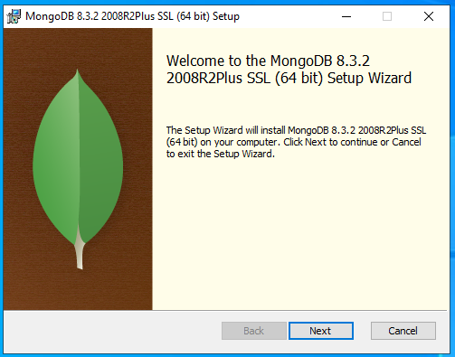


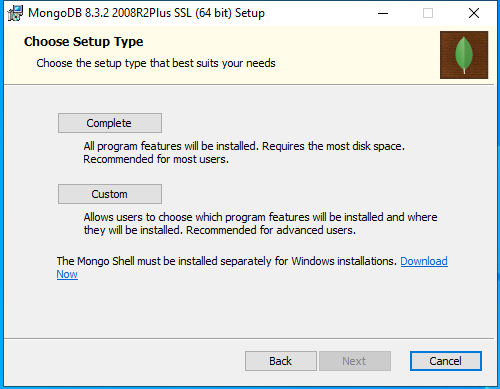

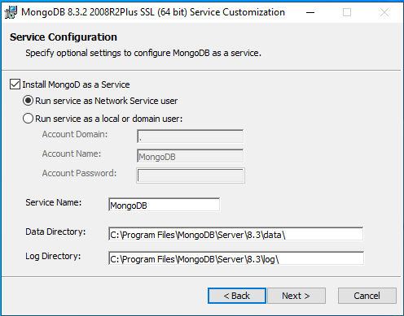


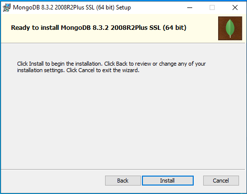

## 2. MongoDB Shell installieren

mongosh installieren.

Prüfen:

```powershell
mongosh --version
```

### Screenshot

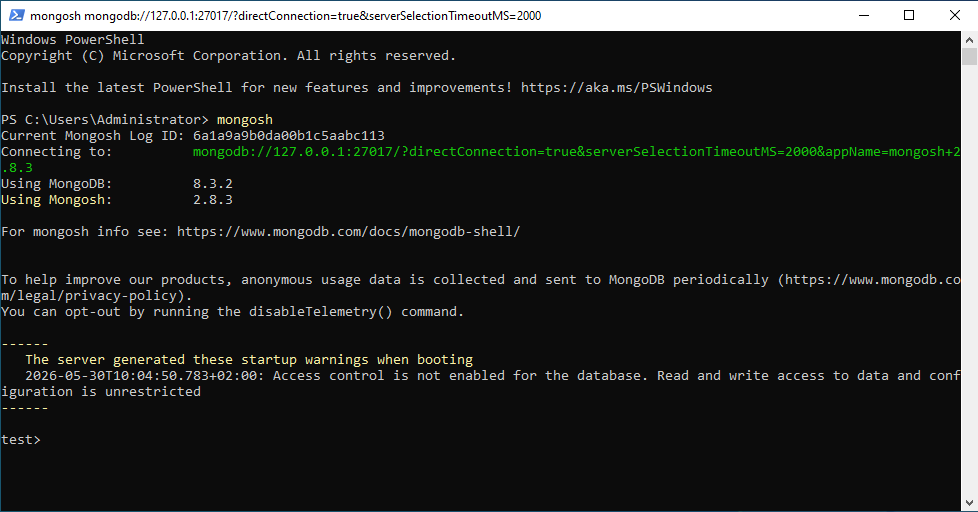


## 3. MongoDB Database Tools installieren

Prüfen:

```powershell
mongoimport --version
```

## 4. Repository klonen

```powershell
git clone https://github.com/ReS86/skt-bigdata-system-performance-etl.git

cd skt-bigdata-system-performance-etl
```

---

# Konfiguration

Standardwerte:

```powershell
Database   = skt_bigdata
Collection = system_performance
```

Das Skript benötigt keine Benutzername-/Passwort-Konfiguration, da MongoDB lokal betrieben wird.

---

# Ausführung

## Manuelle Ausführung

```powershell
.\scripts\Collect-SystemPerformance.ps1
```

## Mit MongoDB Import

```powershell
.\scripts\Collect-SystemPerformance.ps1 -LoadToMongo
```

### Screenshot

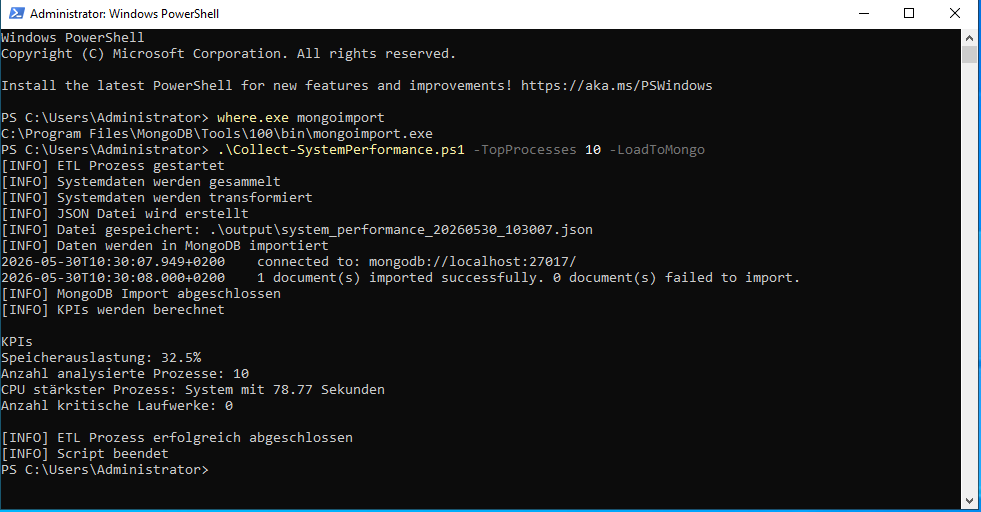

## Top-Prozesse anpassen

```powershell
.\scripts\Collect-SystemPerformance.ps1 -TopProcesses 20 -LoadToMongo
```

---

# ETL-Prozess

## Extract

Erfassung von:

- Betriebssysteminformationen
- CPU Informationen
- Arbeitsspeicher
- Laufwerksdaten
- Top Prozesse nach CPU Nutzung

Verwendete PowerShell-Kommandos:

```powershell
Get-CimInstance
Get-Process
```

---

## Transform

Folgende Werte werden berechnet:

- Speicherauslastung (%)
- Laufwerksauslastung (%)
- Kritischer Speicherplatz
- KPI Werte

---

## Load

Die Daten werden:

1. Als JSON-Datei gespeichert
2. In MongoDB gespeichert

Die Speicherung erfolgt mittels:

```text
Upsert
```

Dadurch entstehen keine Duplikate innerhalb derselben Minute.

---

# Datenqualitätsprüfung

Vor dem Speichern werden folgende Prüfungen durchgeführt:

- _id vorhanden
- Timestamp vorhanden
- Computername vorhanden
- Betriebssystem vorhanden
- RAM-Werte gültig
- Speicherauslastung zwischen 0 und 100 %
- Prozessdaten vorhanden

Fehlerhafte Datensätze werden verworfen und protokolliert.

---

# Logging

Alle Verarbeitungsschritte werden protokolliert.

Logdatei:

```text
C:\Users\Administrator\skt-bigdata-system-performance-etl\logs\etl.log
```

Format:

```text
Timestamp;Level;Message
```

Beispiel:

```text
2026-06-02 15:30:00;INFO;ETL Prozess gestartet
2026-06-02 15:30:01;INFO;Systemdaten werden gesammelt
2026-06-02 15:30:02;INFO;MongoDB Upsert abgeschlossen
```

### Screenshot

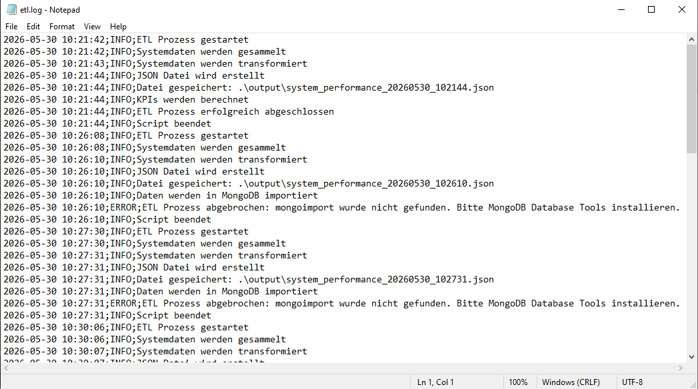
---


# Fehlerbehandlung

Das Skript verwendet:

```powershell
try
catch
finally
```

Kritische Bereiche:

- Datenerfassung
- JSON Export
- MongoDB Operationen
- KPI Berechnung

---

# MongoDB

## Datenbank

```text
skt_bigdata
```

## Collection

```text
system_performance
```

### Screenshot

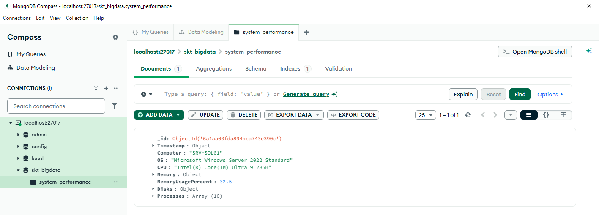
---

# Datenmodell

Beispieldokument:

```json
{
  "_id": "SRV-SQL01_20260602_1535",
  "Timestamp": "2026-06-02T15:35:00",
  "Computer": "SRV-SQL01",
  "OS": "Microsoft Windows Server 2022 Standard",
  "MemoryUsagePercent": 70.83
}
```

---

# MongoDB Indexe

Folgende Indexe werden erstellt:

```javascript
db.system_performance.createIndex({
    Timestamp: -1
})
```

```javascript
db.system_performance.createIndex({
    Computer: 1,
    Timestamp: -1
})
```

Zweck:

- Schnellere Suche nach Zeitstempel
- Schnellere Suche nach Computer und Zeitstempel

### Screenshot

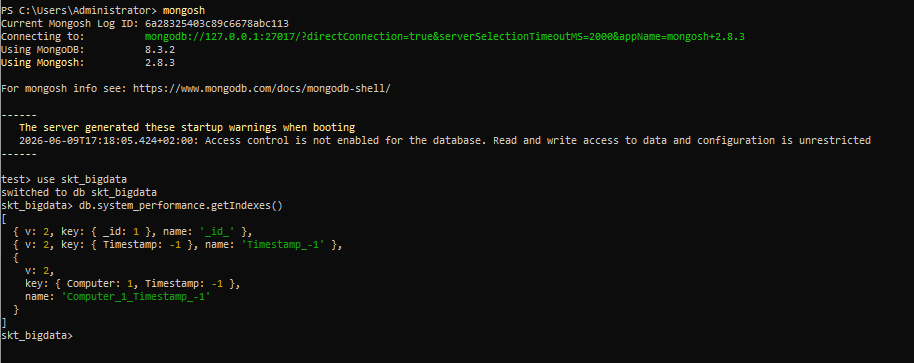
---


# MongoDB Aggregationen

## Durchschnittliche RAM-Auslastung

```javascript
db.system_performance.aggregate([
  {
    $group: {
      _id: "$Computer",
      avgMemoryUsage: {
        $avg: "$MemoryUsagePercent"
      }
    }
  }
])
```

### Screenshot

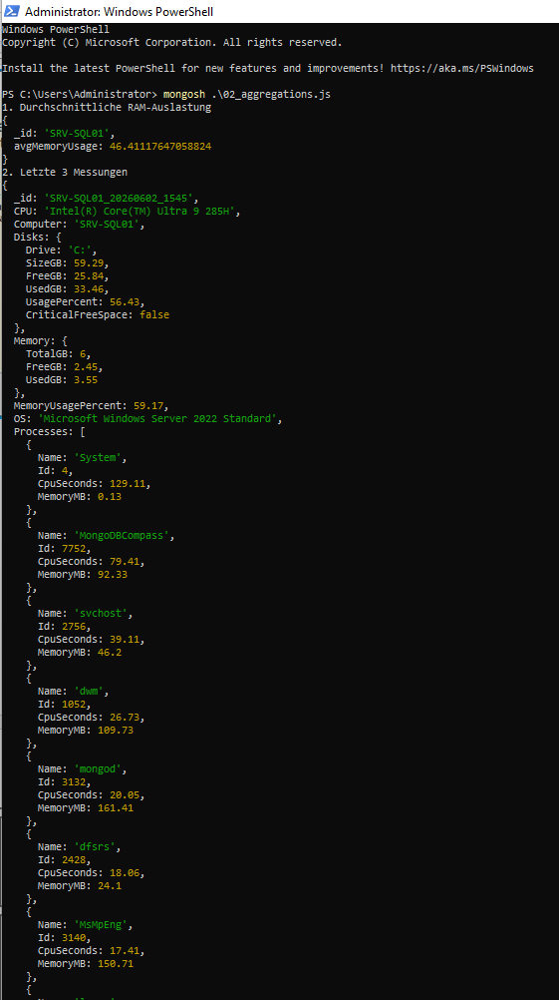
---


## Letzte 3 Messungen

```javascript
db.system_performance.find()
  .sort({ Timestamp: -1 })
  .limit(3)
```

---

## Kritische Laufwerke

```javascript
db.system_performance.aggregate([
  { $unwind: "$Disks" },
  { $match: { "Disks.CriticalFreeSpace": true } },
  {
    $group: {
      _id: "$Computer",
      criticalDisks: {
        $sum: 1
      }
    }
  }
])
```
### Screenshot

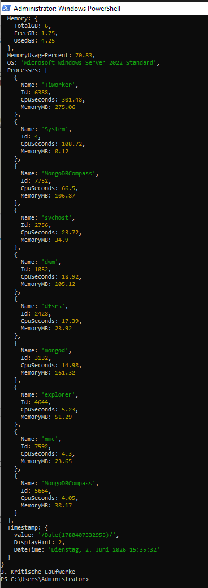

---

# KPI-Auswertung

Das Skript berechnet folgende KPIs:

## KPI 1

Speicherauslastung (%)

Beispiel:

```text
70.83 %
```

---

## KPI 2

Durchschnittliche Laufwerksauslastung (%)

Beispiel:

```text
56.65 %
```

---

## KPI 3

CPU-stärkster Prozess

Beispiel:

```text
TiWorker
```

---

## KPI 4

Anzahl kritischer Laufwerke

Beispiel:

```text
0
```

---

# Automatisierung

Die ETL-Pipeline wird über den Windows Task Scheduler automatisiert ausgeführt.

Taskname:

```text
System_Performance_Run
```

Ausführungsintervall:

```text
Alle 5 Minuten
```

Beispiel:

```powershell
powershell.exe -ExecutionPolicy Bypass -File "C:\Users\Administrator\skt-bigdata-system-performance-etl\scripts\Collect-SystemPerformance.ps1" -TopProcesses 10 -LoadToMongo
```

Script:
C:\Users\Administrator\skt-bigdata-system-performance-etl\scripts\Collect-SystemPerformance.ps1

Arbeitsverzeichnis:
C:\Users\Administrator\skt-bigdata-system-performance-etl

Ausgabe:
C:\Users\Administrator\skt-bigdata-system-performance-etl\output

Logdatei:
C:\Users\Administrator\skt-bigdata-system-performance-etl\logs\etl.log

### Screenshots

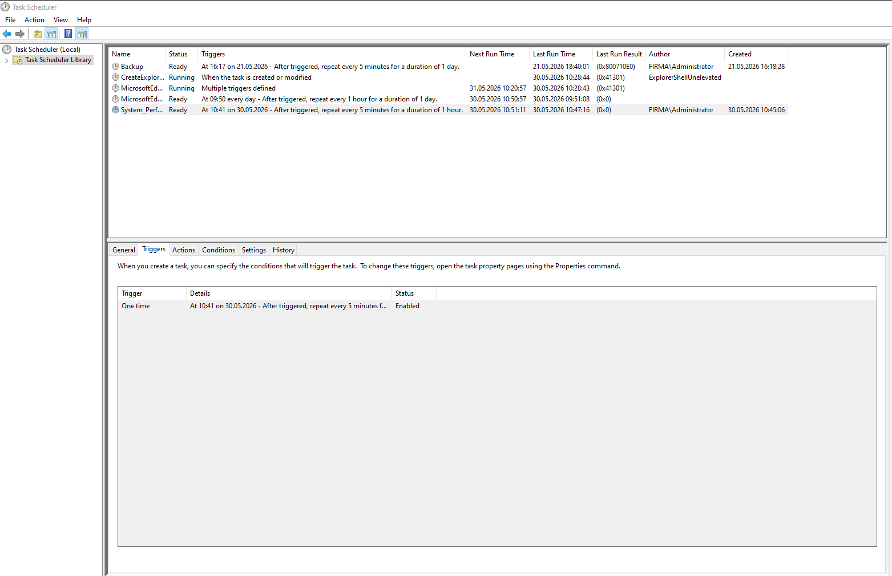

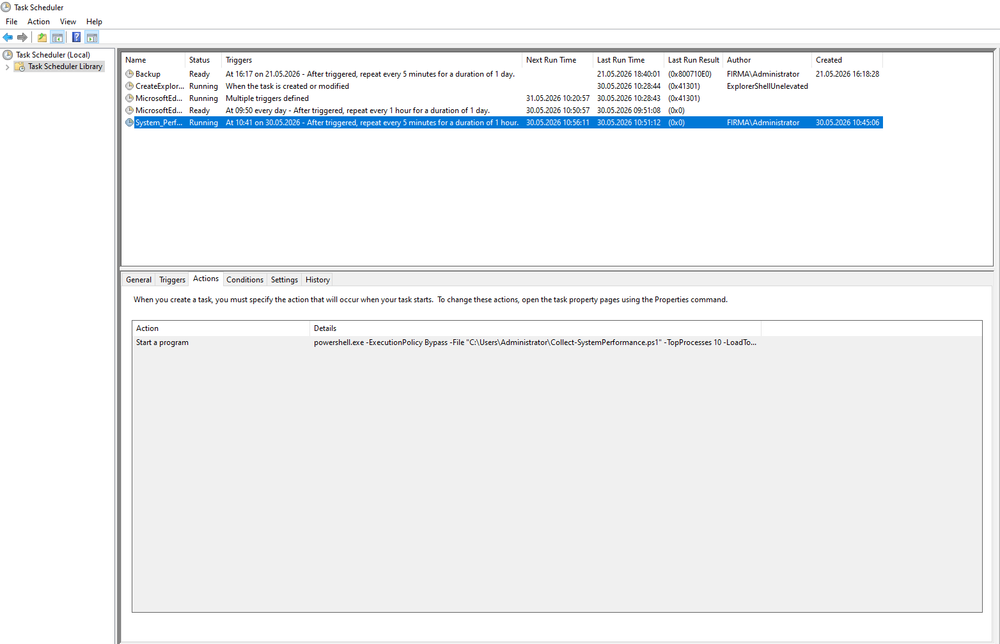

---

# Bekannte Einschränkungen

- Aktuell wird nur ein einzelner Server überwacht.
- Es erfolgt keine Alarmierung bei kritischen Werten.
- Es existiert kein grafisches Dashboard.
- Die Lösung ist auf lokale MongoDB-Instanzen ausgelegt.

---

# Fazit

Mit diesem Projekt wurde eine vollständige ETL-Pipeline auf Basis von PowerShell und MongoDB umgesetzt. Die Lösung automatisiert die Erfassung von Systemleistungsdaten, prüft die Datenqualität, speichert die Daten langfristig in MongoDB und ermöglicht anschliessend deren Analyse mittels KPIs und Aggregationen.

Die Projektarbeit erfüllt die Anforderungen in den Bereichen Skriptingtechnik, ETL, Big Data, Datenqualität, Logging, Fehlerbehandlung, Automatisierung und Datenanalyse.